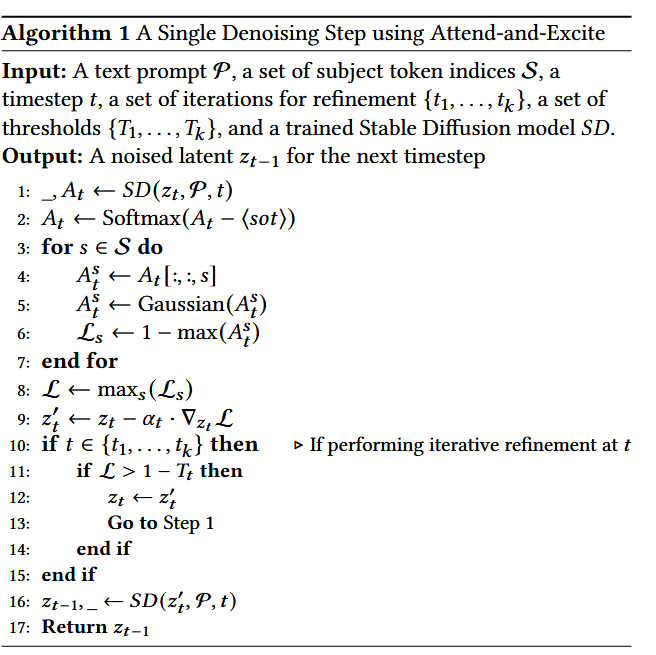

# Attend-and-Excite

## 1. 核心思想
**基于迭代优化方法，在每个去噪步骤中关注并激活提示中subject token**

### 主要解决的问题
- **灾难性忽视**：未能生成输入提示中明确提到的一个或多个subject
- **属性绑定错误**：未能将属性与其主题进行正确绑定

## 2. 技术方法
1. **提取交叉注意力图** (Extracting the Cross-Attention Maps)
2. **获取平滑注意力图** (Obtaining Smooth Attention Maps)
3. **实时优化** (Performing On the Fly Optimization)
4. **获取可解释的图像生成器** (Obtaining Explainable Image Generators)

## 3. 评估指标
1. **CLIP 相似度**
   - 测量生成图像与输入文本提示之间的相似度
2. **BLIP 标题生成**
   - 为创建的图像生成标题
   - 将生成的标题与原始提示进行比较