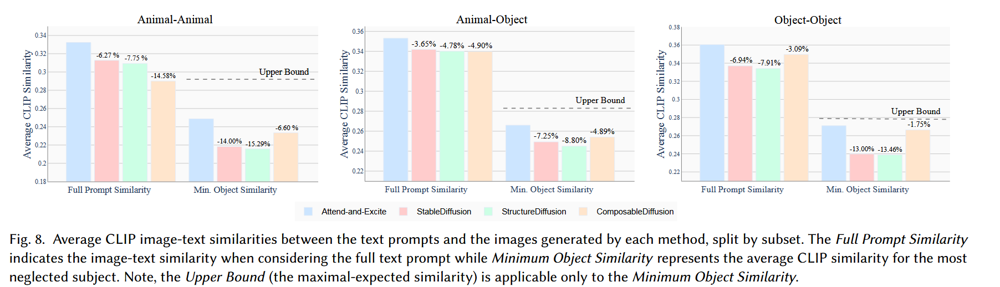
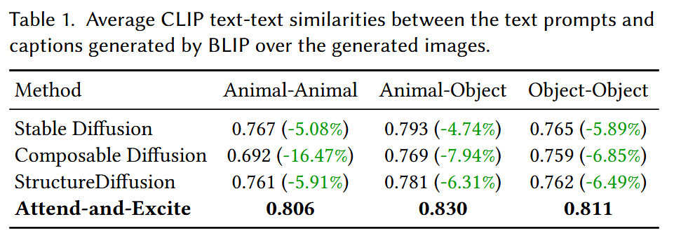

# Attend-and-Excite

## 1. 核心思想
**基于迭代优化方法，在每个去噪步骤中关注并激活提示中subject token**

### 主要解决的问题
- **灾难性忽视**：未能生成输入提示中明确提到的一个或多个subject
- **属性绑定错误**：未能将属性与其主题进行正确绑定

## 2. 技术方法
1. **提取交叉注意力图** (Extracting the Cross-Attention Maps)
2. **获取平滑注意力图** (Obtaining Smooth Attention Maps)
3. **实时优化** (Performing On the Fly Optimization)
4. **获取可解释的图像生成器** (Obtaining Explainable Image Generators)

核心代码：`Attend-and-Excite-main/pipeline_attend_and_excite.py/AttendAndExcitePipeline`

```python
for i, t in enumerate(timesteps):
    with torch.enable_grad():
        latents = latents.clone().detach().requires_grad_(True)

        # Forward pass of denoising with text conditioning
        noise_pred_text = self.unet(
            latents, t,
            encoder_hidden_states=prompt_embeds[1].unsqueeze(0),
            cross_attention_kwargs=cross_attention_kwargs
        ).sample
        self.unet.zero_grad()

        # Get max activation value for each subject token
        max_attention_per_index = self._aggregate_and_get_max_attention_per_token(
            attention_store=attention_store,
            indices_to_alter=indices_to_alter,
            attention_res=attention_res,
            smooth_attentions=smooth_attentions,
            sigma=sigma,
            kernel_size=kernel_size,
            normalize_eot=sd_2_1
        )

        if not run_standard_sd:
            loss = self._compute_loss(max_attention_per_index=max_attention_per_index)

            # If this is an iterative refinement step, verify we have reached the desired threshold for all
            if i in thresholds.keys() and loss > 1. - thresholds[i]:
                del noise_pred_text
                torch.cuda.empty_cache()
                loss, latents, max_attention_per_index = self._perform_iterative_refinement_step(
                    latents=latents,
                    indices_to_alter=indices_to_alter,
                    loss=loss,
                    threshold=thresholds[i],
                    text_embeddings=prompt_embeds,
                    text_input=text_inputs,
                    attention_store=attention_store,
                    step_size=scale_factor * np.sqrt(scale_range[i]),
                    t=t,
                    attention_res=attention_res,
                    smooth_attentions=smooth_attentions,
                    sigma=sigma,
                    kernel_size=kernel_size,
                    normalize_eot=sd_2_1
                )

            # Perform gradient update
            if i < max_iter_to_alter:
                loss = self._compute_loss(max_attention_per_index=max_attention_per_index)
                if loss != 0:
                    latents = self._update_latent(
                        latents=latents,
                        loss=loss,
                        step_size=scale_factor * np.sqrt(scale_range[i])
                    )
                print(f'Iteration {i} | Loss: {loss:0.4f}')
```


## 3. 评估指标
1. **CLIP 相似度**:测量生成图像与输入文本提示之间的相似度

```python
            # extract texture features
            full_text_features = get_embedding_for_prompt(model, prompt, templates=imagenet_templates)
            first_half_features = get_embedding_for_prompt(model, prompt_parts[0], templates=imagenet_templates)
            second_half_features = get_embedding_for_prompt(model, prompt_parts[1], templates=imagenet_templates)

            # extract image features
            images_features = [model.encode_image(image) for image in queries]
            images_features = [feats / feats.norm(dim=-1, keepdim=True) for feats in images_features]

            # compute similarities
            full_text_similarities = [(feat.float() @ full_text_features.T).item() for feat in images_features]
            first_half_similarities = [(feat.float() @ first_half_features.T).item() for feat in images_features]
            second_half_similarities = [(feat.float() @ second_half_features.T).item() for feat in images_features]

            results_per_prompt[prompt] = {
                'full_text': full_text_similarities,
                'first_half': first_half_similarities,
                'second_half': second_half_similarities,
                'image_names': image_names,
            }
```
   - Prompt分解：Split original prompt on 'and' or 'with'
        - a cat and a dog ->a cat,a dog
   - 模板拓展：使用80个ImageNet风格的模板制作caption，提升鲁棒性
        - a cat->a photo of a cat,a rendering of a cat,....
   - 多种聚合方式：计算full-text 相似度和minimum-half 相似度

```python
def aggregate_by_min_half(d):
    """ Aggregate results for the minimum similarity score for each prompt. """
    min_per_half_res = [[min(a, b) for a, b in zip(d[prompt]["first_half"], d[prompt]["second_half"])] for prompt in d]
    min_per_half_res = np.array(min_per_half_res).flatten()
    return np.average(min_per_half_res)


def aggregate_by_full_text(d):
    """ Aggregate results for the full text similarity for each prompt. """
    full_text_res = [v['full_text'] for v in d.values()]
    full_text_res = np.array(full_text_res).flatten()
    return np.average(full_text_res)
```
更高的全文聚合分数表示更好的整体提示表示；
更高的最小半部分聚合分数表示更好地表示了提示的所有部分，证明减少了灾难性忽视。
2. **BLIP 标题生成**
   - 使用BLIP模型来对生成的图像产出caption
   - 将生成的标题与原始提示**两个文本embedding**计算CLIP余弦相似度


## 4.可视化
`utils/vis_utils.py`
- `show_cross_attention`：可视化特定标记的注意力图
- `show_image_relevance`：创建显示相关性的热力图叠加层

## 5. My opinion
1.算法主要针对灾难性忽视改进,对属性绑定错误的改进是顺便改进的
2.需要迭代优化